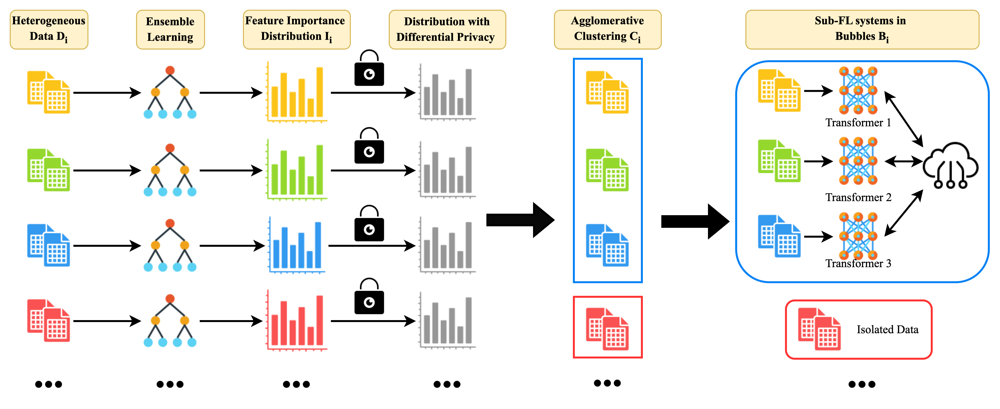

# PA-CFL: Privacy-Adaptive Clustered Federated Learning for Transformer-Based Sales Forecasting

[](https://arxiv.org/abs/2503.12220)
[](https://www.python.org/downloads/)
[](LICENSE)

Official implementation of **"PA-CFL: Privacy-Adaptive Clustered Federated Learning for Transformer-Based Sales Forecasting on Heterogeneous Retail Data"**.

PA-CFL groups retailers into privacy-aware clusters ("bubbles") using differential privacy and feature importance, then trains Transformer models within each bubble via federated averaging for localized sales prediction.

## Overview

<p align="center">
  
</p>

**Pipeline:**
1. Each client trains a local XGBoost model and computes feature importance scores
2. Feature importance scores are encrypted with calibrated Laplace noise (differential privacy)
3. Server performs agglomerative clustering using Earth Mover's Distance, optimized via Davies-Bouldin Index
4. Federated learning (FedAvg with Transformer) runs independently within each bubble
5. Single-client bubbles are flagged as potential attackers and excluded

## Project Structure

```
PA-CFL/
├── src/
│   ├── data/                          # Shared data pipeline
│   │   ├── preprocess.py              # Feature engineering, train/test splits
│   │   └── dataset.py                 # PyTorch dataset classes
│   ├── models/                        # All model architectures
│   │   ├── mlp.py                     # MLP (used in FedAvg/FedProx/IFCA)
│   │   ├── transformer.py            # Transformer (used in PA-CFL + local)
│   │   ├── lstm.py                    # LSTM (local baseline)
│   │   ├── gru.py                     # GRU (local baseline)
│   │   └── cnn.py                     # CNN (local baseline)
│   ├── metrics.py                     # Shared evaluation (RMSE, MAE, R2, etc.)
│   ├── baselines/
│   │   ├── local_learning.py          # Local learning (all architectures)
│   │   ├── fedavg/                    # FedAvg baseline
│   │   │   ├── client.py
│   │   │   ├── server.py
│   │   │   └── run.sh
│   │   ├── fedprox/                   # FedProx baseline (Li et al., 2020)
│   │   │   ├── client.py
│   │   │   ├── server.py
│   │   │   └── run.sh
│   │   └── ifca/                      # IFCA baseline (Ghosh et al., 2020)
│   │       ├── client.py
│   │       ├── server.py
│   │       └── run.sh
│   └── pacfl/                         # PA-CFL (Ours)
│       ├── clustering/
│       │   ├── feature_importance.py  # Step 1: XGBoost feature importance
│       │   ├── differential_privacy.py# Step 2: Laplace noise mechanism
│       │   └── clustering.py          # Step 3: Agglomerative clustering + DBI
│       ├── client.py                  # Step 4: Transformer FL client
│       ├── server.py                  # FedAvg server per bubble
│       ├── run_pipeline.py            # End-to-end pipeline
│       └── run.sh
├── configs/                           # Experiment configurations
├── scripts/
│   ├── prepare_data.py                # Data preprocessing script
│   └── run_all.sh                     # Run all experiments
├── notebooks/
│   └── eda.ipynb                      # Exploratory data analysis (paper figures)
├── figures/                           # Generated figures for the paper
├── data/                              # Raw + processed data (not tracked)
├── logs/                              # Experiment logs
└── requirements.txt
```

## Installation

```bash
git clone https://github.com/your-repo/PA-CFL.git
cd PA-CFL
pip install -r requirements.txt
```

## Data Preparation

Download the [DataCo Smart Supply Chain Dataset](https://www.kaggle.com/datasets/shashwatwork/dataco-smart-supply-chain-for-big-data-analysis) and place `DataCoSupplyChainDataset.csv` in `data/`.

```bash
python scripts/prepare_data.py --raw_data data/DataCoSupplyChainDataset.csv
```

This processes 23 regions into a unified train/test split (80/20) with 27 engineered features, saved to `data/processed/datasets.pkl`. All methods share this same preprocessed data for fair comparison.

## Reproducing Results

### Run All Experiments
```bash
bash scripts/run_all.sh
```

### Run Individual Methods

**Local Learning** (Transformer, LSTM, GRU, CNN, MLP):
```bash
python -m src.baselines.local_learning --model transformer
python -m src.baselines.local_learning --model lstm
python -m src.baselines.local_learning --model gru
```

**FedAvg:**
```bash
bash src/baselines/fedavg/run.sh
```

**FedProx** (mu=0.01):
```bash
bash src/baselines/fedprox/run.sh 0.01
```

**IFCA** (K=3 clusters):
```bash
bash src/baselines/ifca/run.sh 3
```

**PA-CFL** (epsilon=10):
```bash
bash src/pacfl/run.sh 10
```

## Methods

| Method | Type | Description |
|--------|------|-------------|
| Local Learning | Non-FL | Each region trains independently (Transformer/LSTM/GRU/CNN/MLP) |
| FedAvg | FL | Standard federated averaging across all clients |
| FedProx | FL | FedAvg + proximal regularization term (Li et al., 2020) |
| IFCA | CFL | Iterative federated clustering with K models (Ghosh et al., 2020) |
| **PA-CFL (Ours)** | CFL | Privacy-adaptive clustering via DP feature importance + Transformer |

## Results

Average performance comparison on the DataCo Supply Chain Dataset across 8 participating regions (West of USA, US Center, West Africa, North Africa, Central America, South America, East of USA, South of USA). PA-CFL uses Transformer; FedAvg/FedProx/IFCA use MLP.

| Method | R2 Score (%) | RMSE | MAE |
|--------|-------------|------|-----|
| MLP Local | ~94 | ~24 | ~18 |
| CNN Local | ~95 | ~21 | ~16 |
| LSTM Local | ~96 | ~19 | ~15 |
| Transformer Local | 97.83 | 16.08 | 12.85 |
| FedAvg (MLP) | 75.59 | 54.30 | 42.21 |
| FedProx (MLP, mu=0.01) | ~77 | ~52 | ~41 |
| IFCA (MLP, K=3) | ~88 | ~35 | ~28 |
| **PA-CFL (Ours, ε=10)** | **98.51** | **13.41** | **10.53** |

> **Note:** Transformer Local, FedAvg, and PA-CFL values are from the paper. FedProx and IFCA are expected ranges — run experiments to get exact values. MLP/CNN/LSTM/GRU Local rows require running `src/baselines/local_learning.py` with each model.

All experiments are logged to [Weights & Biases](https://wandb.ai/) for tracking and comparison.

## Key Hyperparameters

| Parameter | Value |
|-----------|-------|
| FL rounds | 100 |
| Local epochs per round | 10 |
| Batch size (FL) | 32 |
| Batch size (local) | 64 |
| Privacy budget (epsilon) | 0.1 / 1 / 10 |
| Transformer: hidden_dim / heads / layers | 64 / 8 / 2 |
| MLP: hidden_layers / neurons | 4 / 64 |
| LSTM/GRU: hidden_dim / layers | 64 / 2 |
| FedProx: mu | 0.01 |
| IFCA: K | 3 |

## Citation

```bibtex
@article{long2025bubble,
  title={PA-CFL: Privacy-Adaptive Clustered Federated Learning for Transformer-Based Sales Forecasting on Heterogeneous Retail Data},
  author={Long, Yunbo and Xu, Liming and Zheng, Ge and Brintrup, Alexandra},
  journal={arXiv preprint arXiv:2503.12220},
  year={2025}
}
```
